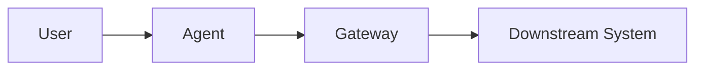

# Output Patterns

Use these patterns to keep generated notes consistent. Adapt the amount of annotation to the article rather than filling every optional section mechanically.

## Base Note

```markdown
---
title: Article Title
source: https://example.com/article
published: 2026-01-01
imported: 2026-01-02
authors:
  - Author Name
tags:
  - technical-english
  - bilingual-learning
---

# Article Title

> [!info] Source
> [Publisher, publication date](https://example.com/article)

![[assets/Article Title/00-cover.png]]

## Original Heading

Original English paragraph remains unchanged.

> [!note]- Vocabulary｜词汇
> - **production-grade** *adj.*：达到生产环境要求的；通常包含可靠性、安全性、监控和维护能力。
> - **at scale**：大规模地；强调负载增长后仍可有效运行。

> [!tip]- Technical Notes｜技术理解
> - 解释该段机制、目的和工程影响。
> - 把它与前后组件或全文主线连接起来。
```

## Lists and Procedures

Keep the complete list together, then add one annotation pair:

```markdown
The process contains four steps:

1. First source step.
2. Second source step.
3. Third source step.
4. Fourth source step.

> [!note]- Vocabulary｜词汇
> - **key expression**：语境释义。

> [!tip]- Technical Notes｜技术理解
> - 按顺序解释输入、验证、状态变化和输出。
```

Do not insert callouts between numbered items when that would break list rendering or separate a figure from its step.

## Technical Comparison

```markdown
| Concept | 回答的问题 | 本文语境 |
|---|---|---|
| Authentication | 你是谁？ | 验证主体和凭证 |
| Authorization | 你能做什么？ | 判断操作是否允许 |
| Accountability | 能否追究责任？ | 保存完整行为主体链 |
```

Use comparison tables only for concepts that learners are likely to confuse.

## Architecture Summary

````markdown

````

Quote Mermaid labels containing spaces or punctuation. Keep the graph small enough to read in Obsidian.

## Review Section

```markdown
---

## 全文学习汇总

### 一句话主旨

用简体中文准确概括全文技术主线。

### 核心词汇表

| Term | 词性/类型 | 中文释义 | 本文技术语境 |
|---|---|---|---|
| term | *n.* | 中文释义 | 在本文中的具体作用 |

### 核心组件职责

| Component | 主要职责 | 关键价值 |
|---|---|---|
| Component A | 职责 | 价值 |

### 复习问题

1. 问题一？
2. 问题二？

> [!success]- 全文记忆主线
> **起点 → 机制 → 策略 → 结果。**
```

## Annotation Quality

- Prefer contextual definitions over literal word-for-word translation.
- Include useful collocations such as `act on behalf of`, not only isolated words.
- Explain abbreviations on first appearance.
- Keep Chinese technical terminology consistent across paragraph notes and the final glossary.
- Use two to eight vocabulary entries per ordinary paragraph; use more only for unusually dense passages.
- Use one to four technical bullets per learning unit.
- Keep callouts collapsed so the original article remains readable.
- Never alter source code, quoted text, identifiers, formulas, or protocol field names while annotating them.
